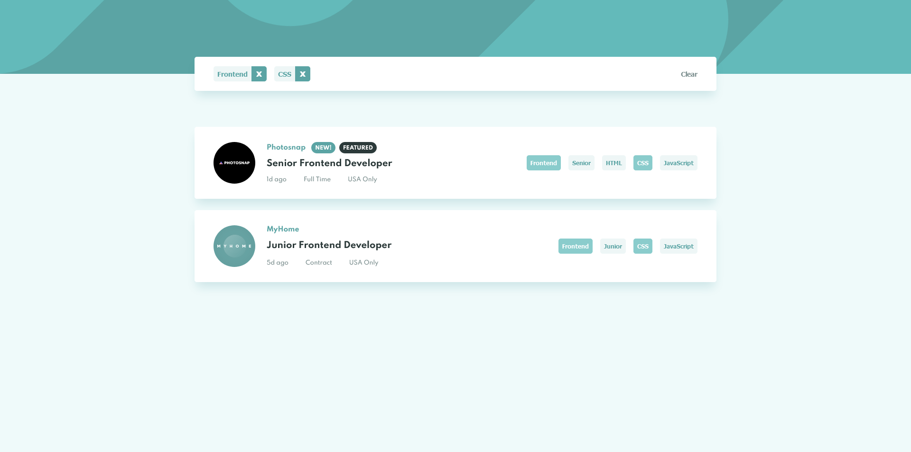

# Frontend Mentor - Job listings with filtering solution

This is a solution to the [Job listings with filtering challenge on Frontend Mentor](https://www.frontendmentor.io/challenges/job-listings-with-filtering-ivstIPCt). Frontend Mentor challenges help you improve your coding skills by building realistic projects. 

## Table of contents

- [Overview](#overview)
  - [The challenge](#the-challenge)
  - [Screenshot](#screenshot)
  - [Links](#links)
- [My process](#my-process)
  - [Built with](#built-with)
- [Author](#author)

## Overview

### The challenge

Users should be able to:

- View the optimal layout for the site depending on their device's screen size
- See hover states for all interactive elements on the page
- Filter job listings based on the categories

### Screenshot

### Links

- [Solution page on FM](https://www.frontendmentor.io/solutions/react-with-redux-toolkit-A7FgROHdF)
- [Live demo](https://job-listings-react-redux-toolkit.vercel.app/)

## My process

### Built with

- Mobile-first workflow
- [React](https://reactjs.org/) - JS library
- [Redux](https://redux.js.org/) - State Manahement library
- [Styled Components](https://styled-components.com/) - For styles

## Author

- Frontend Mentor - [@AgataLiberska](https://www.frontendmentor.io/profile/AgataLiberska)
- Twitter - [@AgataLiberska](https://www.twitter.com/AgataLiberska)

